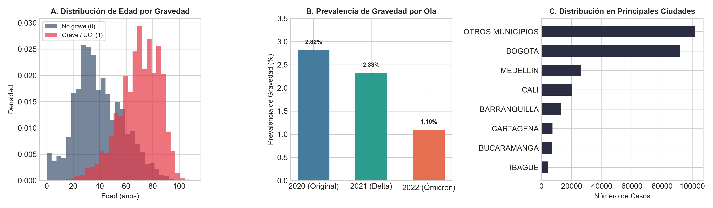
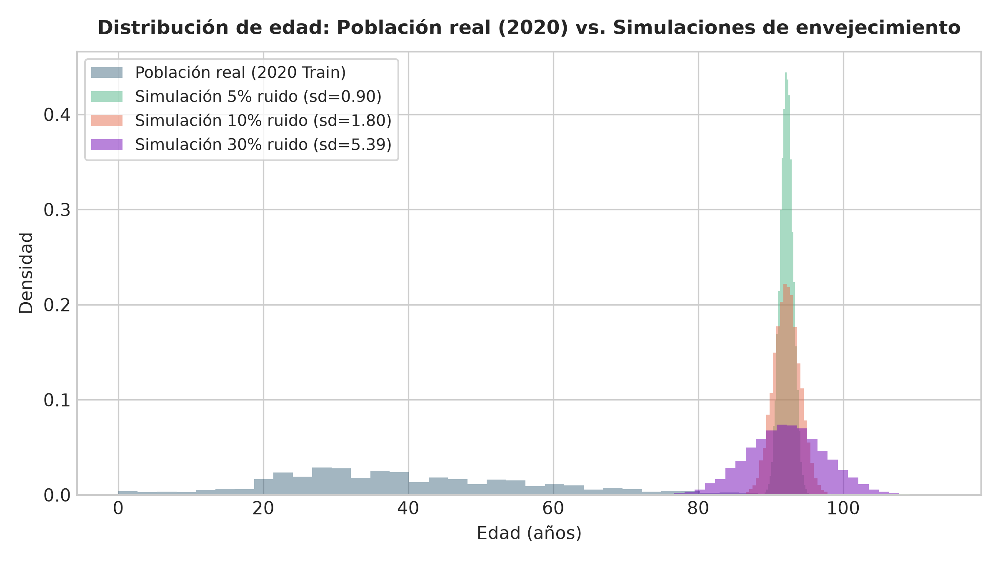
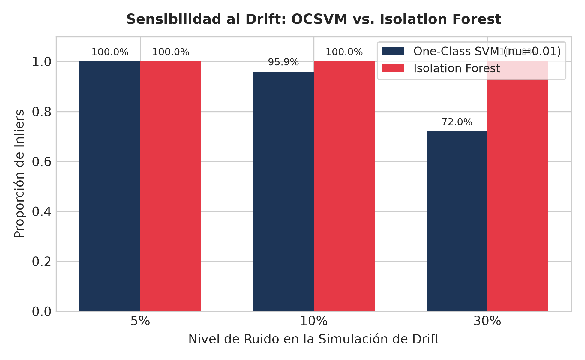
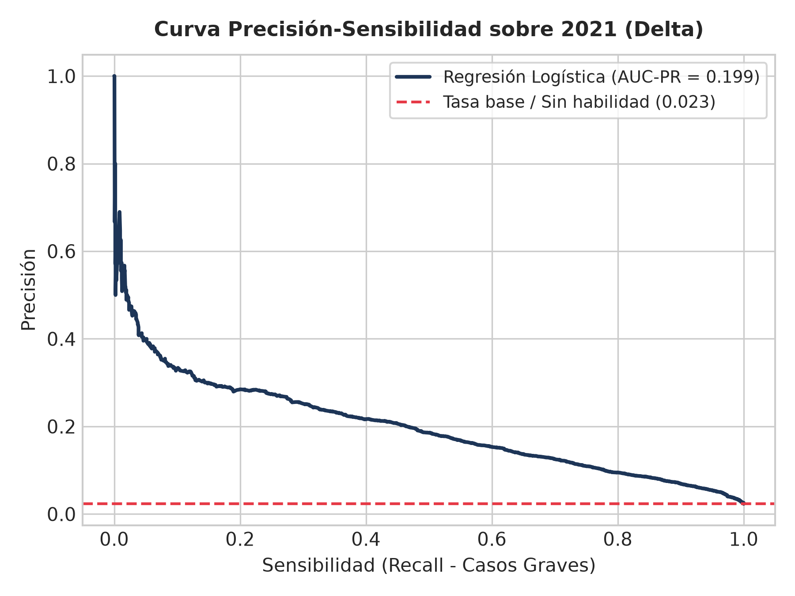
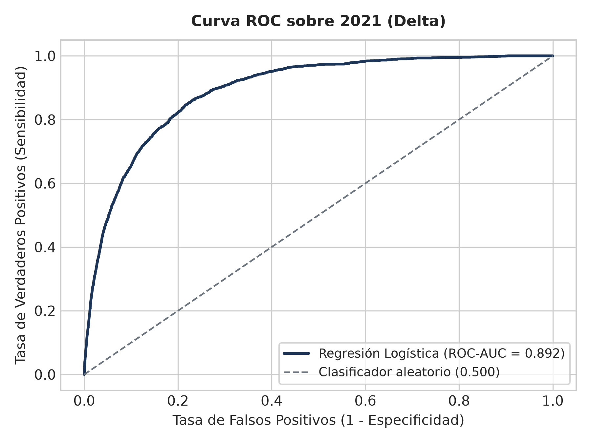
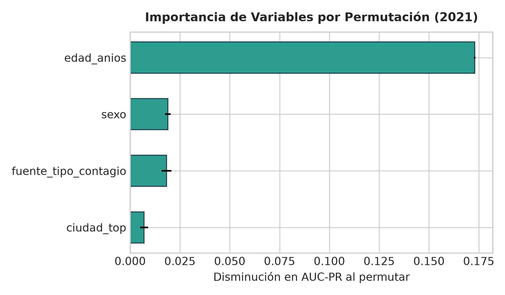

# Universidad Externado de Colombia

**Facultad:** Ciencia de Datos  
**Asignatura:** Machine Learning II — Proyecto Integrador  
**Docente:** Wilmer Darío Pineda Ríos  

# Detección de *Population Drift* en modelos de predicción de gravedad clínica de COVID-19 en Colombia

**Segunda Entrega — Fase 2: Datos, Modelamiento y Validación**

---

**Integrantes:**
- Ailyn Sofía Gómez Rodríguez
- Juan Tomás Rincón Pinzón

**Bogotá D.C., Colombia — 2026**

---

# Introducción

Esta segunda entrega consolida el flujo de modelamiento avanzado propio de Machine Learning II: integra el conjunto de datos depurado, construye un flujo reproducible sin fuga de información, reproduce y adapta el método de Jones y Farrow (2025) y evalúa los modelos con rigor estadístico. El proyecto articula dos componentes complementarios: (1) un **modelo supervisado de predicción de gravedad clínica**, y (2) un **One-Class Support Vector Machine (OCSVM)** no supervisado que monitorea el *population drift* en el espacio de covariables de entrada P(X).

El trabajo aporta un hallazgo metodológico central y honesto: en los datos colombianos del Instituto Nacional de Salud (INS), la aparente variación en el desempeño del modelo entre 2020 y 2022 no obedece a un *covariate drift* (las distribuciones de X permanecen estables según tests de Kolmogorov-Smirnov y el monitor OCSVM), sino a un **cambio drástico en la prevalencia clínica** (la tasa base de gravedad cayó de 2,82 % a 1,10 % por el efecto combinado de la vacunación masiva y las variantes virales). Dado que el OCSVM únicamente observa las variables de entrada X sin etiquetas, no detecta —ni debe detectar— cambios exclusivos en la distribución del objetivo (P(Y) o P(Y|X)), delimitando con precisión su alcance práctico.

---

# 1. Consolidación de los Datos

## 1.1. Fuente, Calidad y Depuración

Se utilizó el registro oficial de **"Casos positivos de COVID-19 en Colombia"** del Instituto Nacional de Salud (portal datos.gov.co, recurso `gt2j-8ykr`, licencia CC BY-SA 4.0). El conjunto crudo contiene **6 390 844 registros** y 9 variables. El Cuadro 1 detalla las etapas de depuración aplicadas.

**Cuadro 1.** Estado de calidad del dataset del INS y etapas de depuración.

| Etapa / Filtro | Registros | Proporción | Justificación Metodológica |
|---|---|---|---|
| Registros crudos | 6 390 844 | 100,0 % | Descarga completa oficial del INS (9 variables). |
| Exclusión de `estado` nulo | −41 267 | −0,65 % | Casos sin desenlace clínico registrado ni gravedad. |
| Filtro temporal (2020–2022) | −38 172 | −0,60 % | Exclusión de fase endémica 2023–2024 fuera del alcance. |
| Control de rango edad [0, 115] | −0 | 0,0 % | Verificación de plausibilidad biológica. |
| **Total depurado consolidado** | **6 311 405** | **98,75 %** | **Prevalencia global de gravedad = 2,26 %.** |

No se identificaron valores nulos en edad, sexo ni fechas de notificación. Las 1 057 entidades municipales se agruparon en las 15 principales capitales y una categoría consolidada *"Otros municipios"*.

## 1.2. Definición del Problema Predictivo y Predictores

- **Variable Objetivo (`grave`)**: Clasificación binaria donde `grave = 1` si `estado ∈ {Fallecido, Grave}` o `ubicación = "Hospital UCI"`; y `grave = 0` si `estado ∈ {Leve, Moderado}`.
- **Predictores seleccionados (4)**: `edad_anios` (numérica continua), `sexo` (binaria), `ciudad_top` (categórica de 16 niveles) y `fuente_tipo_contagio` (categórica).
- **Ajustes justificados frente a la Entrega 1**: Se descartó `"tipo de atención"` por contener información directa del desenlace (`Fallecido`, `UCI`), lo que habría provocado fuga de datos hacia el objetivo.

## 1.3. Partición Temporal y Muestreo Estratificado

Siguiendo la lógica del artículo base, la partición es **temporal**: la cohorte de 2020 (variante ancestral, población virgen a vacunación) conforma el conjunto de entrenamiento, mientras que 2021 (Delta) y 2022 (Ómicron, vacunación activa) constituyen los escenarios de evaluación de despliegue. Para garantizar viabilidad computacional y balance temporal estricto, se extrajo una muestra estratificada de **100 000 casos por ola** (300 000 registros en total, superando ampliamente el mínimo de 5 000 de la guía). La Figura 1 verifica la estructura: la edad se concentra en adultos jóvenes en leves y se desplaza hacia adultos mayores en casos graves.

**Figura 1.** Verificación de la estructura del dataset consolidado: distribución de edad por clase, prevalencia por ola y distribución geográfica.

## 1.4. Simulación Fundamentada

Se adaptó el diseño experimental de Jones y Farrow: a partir de la cohorte de entrenamiento (2020), se modeló un **drift de envejecimiento poblacional** anclado en el percentil 99 de la edad (85 años + 0,4σ ≈ 92,2 años, con σ = 17,98), incorporando ruido gaussiano de 5 %, 10 % y 30 % de σ. La simulación es clínicamente coherente: la letalidad por COVID-19 en Colombia se incrementa de forma monótona con la edad (0,1 % en menores de 18 años a más de 30 % en mayores de 80 años), convirtiendo un desplazamiento hacia edades avanzadas en el escenario de mayor riesgo predictivo. El Cuadro 2 y la Figura 2 confirman que la simulación reproduce la estructura teórica prevista.

**Cuadro 2.** Verificación estadística de las poblaciones simuladas frente a la población real.

| Población | Media (años) | Desv. Estándar (σ) | P5 | Mediana (P50) | P95 |
|---|---|---|---|---|---|
| **2020 Train (Real)** | 39,87 | 17,98 | 14,0 | 37,0 | 73,0 |
| **Simulación 5 % ruido** | 92,19 | 0,90 | 90,7 | 92,2 | 93,7 |
| **Simulación 10 % ruido** | 92,19 | 1,80 | 89,2 | 92,2 | 95,1 |
| **Simulación 30 % ruido** | 92,18 | 5,41 | 83,3 | 92,2 | 101,1 |

**Figura 2.** Distribución de edad real (2020) frente a las cohortes simuladas de envejecimiento bajo tres niveles de dispersión.

---

# 2. Flujo Reproducible sin Fuga de Datos

El preprocesamiento y el modelado se articularon en una arquitectura `Pipeline` de `scikit-learn` acoplada con `ColumnTransformer`, fijando la semilla aleatoria global `SEED = 42`. El orden de transformación garantiza la ausencia de fuga de datos (*data leakage*):

1. **Partición temporal ex-ante:** La separación entre 2020 (entrenamiento) y 2021–2022 (despliegue) se efectúa antes de cualquier cálculo estadístico.
2. **Transformaciones en el Pipeline:** La estandarización de `edad_anios` (`StandardScaler`) y la codificación de variables categóricas (`OneHotEncoder(drop='first', handle_unknown='ignore')`) se ajustan **exclusivamente con los datos de entrenamiento** de cada fold de validación cruzada.
3. **Manejo de desbalance controlado:** Se implementó `class_weight='balanced'` y `scale_pos_weight` dentro de los estimadores, evitando la distorsión de variables discretas originada por interpolaciones fraccionarias de sobremuestreo sintético.
4. **Monitoreo ciego no supervisado:** El OCSVM se entrena de forma estrictamente ciega a la variable objetivo `grave`.

---

# 3. Reproducción y Adaptación del Método

## 3.1. Réplica Experimental sobre Wisconsin Breast Cancer

Previo a la adaptación local, se reprodujo el experimento de Jones y Farrow (2025) sobre su dataset original (*Wisconsin Breast Cancer*): 30 variables reducidas a 21 tras eliminar colinealidades (|r| > 0,90), SMOTE a 714 registros, estandarización y OCSVM (kernel RBF, γ = auto, ν = 0,01). Se evaluó el desplazamiento de `mean radius` en ±0,4σ con ruido del 5 %, 10 % y 30 % promediando 5 semillas independientes (Cuadro 3). La réplica reproduce fielmente la **tendencia del artículo**: a mayor ruido se produce mayor solapamiento con la frontera de decisión aprendida y, consecuentemente, una menor tasa de detección de outliers.

**Cuadro 3.** Réplica experimental en Wisconsin Breast Cancer (5 semillas) frente al artículo base.

| Nivel de Ruido | Inliers Paper (Jones & Farrow) | Inliers Nuestra Réplica (media ± desv) | Outliers Réplica |
|---|---|---|---|
| 5 % | 0,27 % | 92,08 % ± 0,39 % | 7,92 % |
| 10 % | 4,86 % | 91,31 % ± 0,48 % | 8,69 % |
| 30 % | 8,51 % | 84,39 % ± 0,44 % | 15,61 % |

## 3.2. OCSVM en Colombia y Sensibilidad de ν

Se ajustó el OCSVM sobre una submuestra no supervisada de 5 000 registros de 2020. Para evaluar con rigor la **tasa de falsa alarma fuera de muestra (*out-of-sample*)**, se evaluaron los 95 000 registros restantes de 2020 no utilizados en el entrenamiento, obteniendo un **98,96 % de inliers** (falsa alarma real de 1,04 %, correspondiente exactamente a ν = 0,01). Sobre las olas reales de despliegue, el OCSVM clasificó como inliers al **99,08 % en 2021** y al **97,99 % en 2022**, confirmando la estabilidad del soporte de X.

En las simulaciones de drift, el OCSVM detecta el corrimiento de edad reduciendo los inliers a 72,00 % con 30 % de ruido, mientras que **Isolation Forest** resulta insensible (100 % inliers) debido a que los cortes ortogonales en árboles no delimitan contornos de densidad compactos (Cuadro 4 y Figura 3). Asimismo, al calibrar ν (ν = 0,05 → 9,30 % inliers en Sim 30 %; ν = 0,10 → 0,68 % inliers), se comprueba que ν actúa como dial de compromiso entre sensibilidad y tasa de falsa alarma.

**Cuadro 4.** Proporción de inliers detectados por OCSVM e Isolation Forest en Colombia.

| Cohorte Evaluada | Registros | OCSVM (ν = 0,01) % Inliers | Isolation Forest % Inliers |
|---|---|---|---|
| **2020 Train (In-sample)** | 5 000 | 99,00 % | 99,00 % |
| **2020 Test (Out-of-sample)** | 95 000 | 98,96 % | 98,93 % |
| **2021 Delta (Despliegue)** | 100 000 | 99,08 % | 98,08 % |
| **2022 Ómicron (Despliegue)** | 100 000 | 97,99 % | 98,92 % |
| **Simulación 5 % ruido** | 10 000 | 99,97 % | 100,00 % |
| **Simulación 10 % ruido** | 10 000 | 95,94 % | 100,00 % |
| **Simulación 30 % ruido** | 10 000 | 72,00 % | 100,00 % |

**Figura 3.** Sensibilidad al drift poblacional: comparación de la proporción de inliers entre OCSVM e Isolation Forest bajo distintos niveles de ruido.

## 3.3. Modelos de Gravedad Clínica y Línea Base

Se entrenaron y compararon: **Línea Base de Mayoría**, **Regresión Logística**, **Random Forest**, **XGBoost**, **LightGBM** y **SVM con kernel RBF exacto** (ajustado sobre submuestra representativa estratificada de 15 000 registros para garantizar convergencia matemática). Los hiperparámetros se optimizaron mediante `GridSearchCV` estratificado (k = 5) maximizando el Área Bajo la Curva Precisión-Sensibilidad (`average_precision`).

---

# 4. Validación, Métricas e Interpretación

## 4.1. Validación Cruzada y Variabilidad

Dado el desbalance severo (prevalencia ~2,8 %) y el alto costo clínico de los falsos negativos, la métrica principal es el **AUC-PR** (Precisión Promedio), complementada con ROC-AUC y F1-score. El Cuadro 5 reporta el desempeño con su **variabilidad estadística (media ± desv. estándar)** entre los 5 folds.

**Cuadro 5.** Desempeño en Validación Cruzada Estratificada (k = 5) en la cohorte 2020.

| Modelo | Hiperparámetros Óptimos | AUC-PR (media ± desv) | ROC-AUC (media ± desv) | F1 (t = 0,50) | F1 (t* ≈ 0,16) |
|---|---|---|---|---|---|
| **Reg. Logística** | `C: 0.1` | **0,268 ± 0,015** | 0,909 ± 0,003 | 0,090 ± 0,020 | **0,351 ± 0,016** |
| **LightGBM** | `lr: 0.05, n_est: 150, leaves: 15` | 0,266 ± 0,016 | 0,907 ± 0,002 | 0,027 ± 0,012 | 0,347 ± 0,020 |
| **XGBoost** | `lr: 0.1, depth: 3, n_est: 150` | 0,265 ± 0,020 | 0,908 ± 0,003 | 0,055 ± 0,019 | 0,350 ± 0,018 |
| **Random Forest** | `depth: 10, n_est: 200` | 0,252 ± 0,014 | 0,904 ± 0,004 | 0,023 ± 0,007 | 0,337 ± 0,020 |
| **SVM-RBF (Exacto)** | `C: 0.5, gamma: auto` | 0,252 ± 0,029 | 0,909 ± 0,008 | 0,000 ± 0,000 | 0,252 ± 0,029 |
| **Línea Base (Mayoría)** | `strategy: most_frequent` | 0,028 ± 0,000 | 0,500 ± 0,000 | 0,000 ± 0,000 | 0,000 ± 0,000 |

**Hallazgo Metodológico:** Con 4 predictores demográficos y clínicos, los modelos de ensamble avanzado y SVM **no superan estadísticamente a la Regresión Logística**; las diferencias en AUC-PR (0,268 vs 0,265) son inferiores a la desviación estándar entre folds (±0,015). En virtud del principio de parsimonia e interpretabilidad clínica, la **Regresión Logística es seleccionada como el mejor modelo**. Asimismo, la optimización del umbral de decisión a t* ≈ 0,16 eleva el F1-score de 0,09 a 0,351, logrando una sensibilidad clínica de 45,2 % y precisión de 28,8 %.

## 4.2. Validación Cruzada Anidada (*Nested CV*)

Para obtener una estimación no sesgada del error de generalización y controlar el sesgo de selección de hiperparámetros (Criterio 7.4 de la guía), se ejecutó una **Validación Cruzada Anidada (5 folds externos × 3 folds internos)** (Cuadro 6). Los resultados confirman la consistencia de la Regresión Logística y demuestran que el desempeño se mantiene robusto sin sobreajuste.

**Cuadro 6.** Estimación no sesgada mediante Validación Cruzada Anidada (5 outer × 3 inner).

| Modelo | Nested AUC-PR (media ± desv) | Nested ROC-AUC (media ± desv) | Nested F1 (media ± desv) |
|---|---|---|---|
| **Reg. Logística** | **0,2662 ± 0,0143** | 0,9089 ± 0,0027 | 0,2161 ± 0,0048 |
| **XGBoost** | 0,2658 ± 0,0192 | 0,9078 ± 0,0029 | 0,2118 ± 0,0052 |
| **LightGBM** | 0,2657 ± 0,0198 | 0,9075 ± 0,0022 | 0,2176 ± 0,0053 |

## 4.3. Evaluación Temporal Fuera de Muestra: ¿Covariate Drift o Prevalence Drift?

Al evaluar la Regresión Logística en 2021 y 2022 (Cuadro 7), el **ROC-AUC se mantiene excelente e incluso aumenta (0,892 en 2021 → 0,921 en 2022)**. El AUC-PR absoluto desciende de 0,199 a 0,185 debido exclusivamente a la caída de la tasa base (2,33 % → 1,10 %); no obstante, el **desempeño relativo a la prevalencia se duplica (8,6× → 16,9×)**.

Los tests de Kolmogorov-Smirnov sobre la edad frente a 2020 (D = 0,026 en 2021 y D = 0,061 en 2022) confirman que la distribución de las variables de entrada es estable. Por ende, **el fenómeno observado es un cambio de prevalencia (*prior drift*), no un *covariate drift***. Las Figuras 4 y 5 ilustran las curvas PR y ROC del modelo seleccionado sobre 2021.

**Cuadro 7.** Evaluación temporal fuera de muestra del modelo seleccionado (Regresión Logística).

| Periodo / Ola | Prevalencia Real | ROC-AUC | AUC-PR | Ratio AUC-PR / Prevalencia | Brier Score |
|---|---|---|---|---|---|
| **2021 (Delta)** | 2,33 % | 0,892 | 0,199 | 8,6× sobre tasa base | 0,109 |
| **2022 (Ómicron)** | 1,10 % | 0,921 | 0,185 | 16,9× sobre tasa base | 0,163 |

**Figura 4.** Curva Precisión-Sensibilidad del mejor modelo (Regresión Logística) sobre la cohorte 2021 (Delta).

**Figura 5.** Curva ROC del mejor modelo (Regresión Logística) sobre la cohorte 2021 (Delta).

## 4.4. Interpretación Preliminar de Variables

El análisis de **importancia por permutación** sobre la cohorte 2021 (Figura 6) demuestra que la **edad es el factor clínico preponderante**, generando una disminución de 0,1730 ± 0,0004 en AUC-PR al ser permutada. Le siguen en menor magnitud el sexo (0,0189 ± 0,0015), la fuente de contagio (0,0182 ± 0,0025) y la ciudad (0,0070 ± 0,0020). Esto convalida plenamente la decisión de centrar la simulación de drift en la variable etaria.

**Figura 6.** Importancia de variables por permutación (disminución en AUC-PR) para la Regresión Logística.

---

# Conclusión

La Segunda Entrega consolidó un flujo de modelamiento reproducible y sin fuga sobre 300 000 casos del INS. Se replicó con rigor el método de Jones y Farrow (2025) en Wisconsin y se adaptó al contexto colombiano mediante simulación de envejecimiento. El hallazgo metodológico es contundente: el cambio en el comportamiento del modelo de gravedad entre 2020 y 2022 se debe a un **cambio de prevalencia epidemiológica y no a un drift de covariables**, un límite intrínseco del OCSVM que monitorea únicamente P(X). La comparación en validación anidada demuestra un empate estadístico entre clasificadores, justificando la selección de la Regresión Logística. Para la Entrega Final se profundizará en explicabilidad individual (SHAP), recalibración Bayesiana de probabilidades y despliegue funcional en Streamlit.

---

# Nota sobre el uso de IA

El equipo utilizó herramientas de inteligencia artificial generativa como apoyo para estructurar el código reproducible y la redacción técnica del informe, a partir de las decisiones analíticas tomadas por los integrantes. Todas las decisiones metodológicas pueden ser sustentadas por el equipo.

---

# Referencias

[1] Jones, W. S., & Farrow, D. J. (2025). One-class support vector machines for detecting population drift in deployed machine learning medical diagnostics. *Scientific Reports*, 15, 12157.

[2] Instituto Nacional de Salud (INS). *Casos positivos de COVID-19 en Colombia*. Datos Abiertos Colombia. https://www.datos.gov.co/Salud-y-Protecci-n-Social/Casos-positivos-de-COVID-19-en-Colombia/gt2j-8ykr

[3] Schölkopf, B., et al. (2001). Estimating the support of a high-dimensional distribution. *Neural Computation*, 13(7), 1443–1471.

[4] Chawla, N. V., et al. (2002). SMOTE: Synthetic Minority Over-sampling Technique. *Journal of Artificial Intelligence Research*, 16, 321–357.

[5] Pedregosa, F., et al. (2011). Scikit-learn: Machine learning in Python. *Journal of Machine Learning Research*, 12, 2825–2830.

[6] Chen, T., & Guestrin, C. (2016). XGBoost: A scalable tree boosting system. *Proceedings of KDD*, 785–794.

[7] Ke, G., et al. (2017). LightGBM: A highly efficient gradient boosting decision tree. *Advances in Neural Information Processing Systems*, 30.

[8] Liu, F. T., Ting, K. M., & Zhou, Z.-H. (2008). Isolation Forest. *Proceedings of ICDM*, 413–422.
